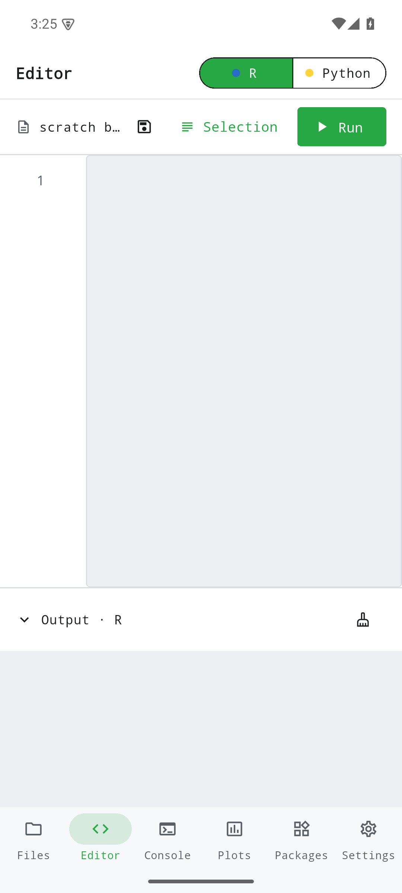

Flagship-Laufzeit

> R und Python auf dem Telefon, vollständig offline.

Établi Atelier ist eine polyglotte IDE, die R (via WebR) und Python (via Pyodide) als umschaltbare Kernel innerhalb einer eingebetteten WebAssembly-Laufzeit ausführt. Beide Kernel teilen sich ein gemeinsames virtuelles Dateisystem; `numpy`, `pandas`, `scipy`, `matplotlib` und `scikit-learn` sind vorinstalliert. Plots aus base R, ggplot2 und matplotlib lassen sich als PNG exportieren. Kein Netz, kein Konto, keine Telemetrie.

{width=320}

## Wer profitiert davon

Forschende, Studierende und Praktiker, die Statistik- und Datenwissenschafts-Code mobil schreiben, prüfen oder demonstrieren möchten — etwa unterwegs, in Lehrsituationen ohne Laborrechner oder in Umgebungen ohne Internet.

## Plattformen

| Plattform | Status |
|-----------|--------|
| iOS       | ✓      |
| Android   | ✓      |
| macOS     | ✓      |
| Linux     | ✓      |
| Windows   | ✓      |

## Datenschutz

Keine Analyse-Tools, keine Drittanbieter-SDKs. Die App arbeitet vollständig offline; weder Code noch Daten verlassen das Gerät. Es gibt keine Konten, keine Telemetrie, keine impliziten Netzwerkanfragen.

## Installation

Établi Atelier befindet sich **in aktiver Entwicklung**. Es gibt noch keine Veröffentlichung im App Store, bei Google Play oder F-Droid.

| Kanal | Status |
|-------|--------|
| Android (APK) | **Entwicklungs-Build** über [GitHub Releases](https://github.com/etabli-dev/etabli-atelier/releases) |
| App Store (iOS) | geplant — noch nicht verfügbar |
| Google Play | geplant — noch nicht verfügbar |
| F-Droid | geplant — noch nicht verfügbar |
| Desktop (macOS, Windows, Linux) | Build aus dem Quellcode |

Details siehe [Erste Schritte](getting-started.qmd).

## Unterstützen

Wenn dir die App nützt: [Liberapay](https://liberapay.com/rabanheller/).
