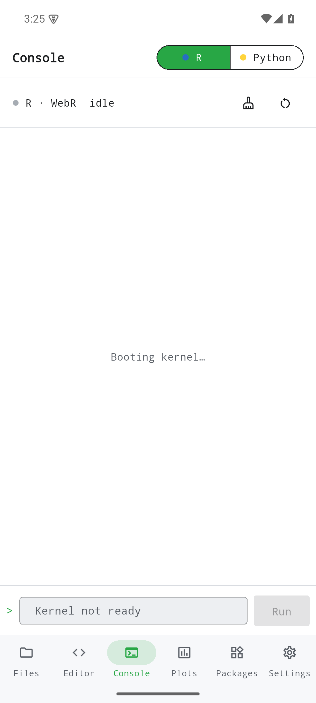
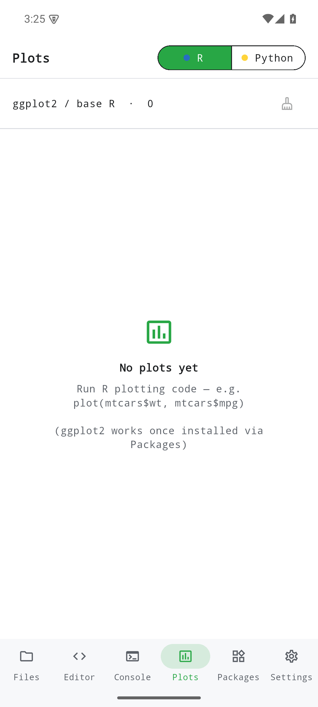
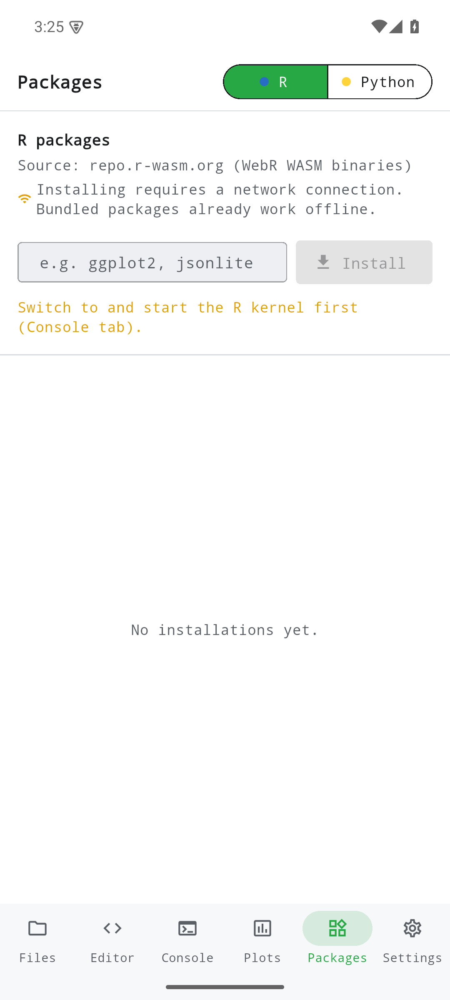
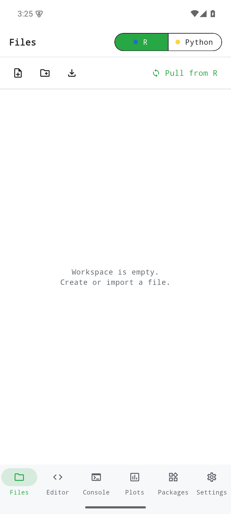
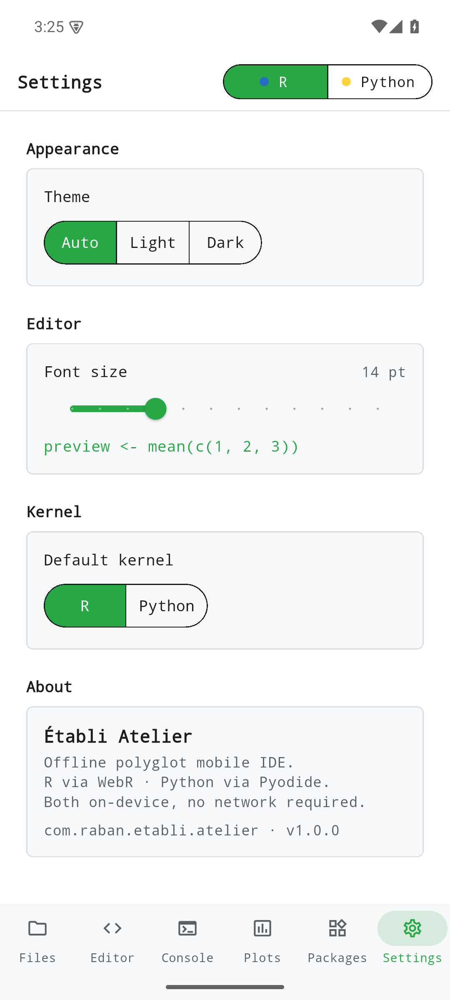

Établi Atelier réunit deux runtimes WebAssembly complets — R (via WebR) et Python (via Pyodide) — derrière une interface monospaced unique, les deux noyaux partageant un même système de fichiers virtuel. Les captures ci-dessous proviennent réellement de la version de développement v0.1.0 exécutée sur un émulateur Android. Elles parcourent chaque partie de l'application telle que vous la rencontrez : l'Éditeur et son sélecteur de noyau R / Python, la Console, la galerie de graphiques, la gestion des paquets, le navigateur de fichiers et les Réglages.

Une remarque sur le périmètre : Atelier v0.1.0 ne fournit pas encore de code d'exemple R ou Python intégré et repérable dans l'app. Cette présentation montre donc les états réels de chaque écran plutôt qu'une exécution guidée unique (Éditeur → Exécuter → Console → Graphiques). Une galerie d'« Exemples » intégrée est prévue pour une prochaine version ; en attendant, le parcours ci-dessous reflète exactement l'aspect de l'application au premier lancement.

## Éditeur et sélecteur de noyau R / Python

L'Éditeur est l'écran d'arrivée au premier lancement : un éditeur de code au-dessus d'un tampon de travail, avec une action **Exécuter** et un sélecteur de noyau **R / Python** dans la barre supérieure. Basculer ce sélecteur change l'interpréteur qui exécute votre code, tandis que les deux noyaux continuent de partager un même système de fichiers virtuel ; un fichier écrit depuis R est lisible depuis Python sans conversion. Au démarrage, le tampon est vide et le noyau est réglé sur **R**.

{width=320}

## Console

La Console héberge la session vivante du noyau. Vous démarrez la session, puis exécutez du code depuis l'Éditeur et voyez la sortie texte apparaître ici. L'en-tête du panneau de sortie suit le noyau actif, affichant `Output · R` ou `Output · Python` selon le sélecteur, de sorte que vous savez toujours quel interpréteur a produit ce que vous regardez.

{width=320}

## Graphiques

Les graphiques rendus par base R (`plot(...)`), ggplot2 ou matplotlib apparaissent dans l'onglet Graphiques. Chaque graphique est versé dans la galerie et peut être exporté en PNG ; vous pouvez ainsi enregistrer ou partager une figure directement depuis l'appareil, sans passer par un ordinateur de bureau.

{width=320}

## Paquets

L'écran Paquets installe des bibliothèques supplémentaires au-delà de l'ensemble préinstallé : paquets R depuis `repo.r-wasm.org` (binaires WASM WebR) ou paquets Python via Pyodide. Les bibliothèques préinstallées — `numpy`, `pandas`, `scipy`, `matplotlib`, `scikit-learn` côté Python, ainsi que l'ensemble standard de base R — fonctionnent déjà entièrement hors ligne. Installer quoi que ce soit de plus est la seule action volontaire qui atteint le réseau, et elle requiert une connexion ainsi qu'un noyau en cours d'exécution.

{width=320}

## Fichiers

Le navigateur de fichiers ouvre le système de fichiers virtuel partagé que voient les deux noyaux. De là, vous créez, ouvrez et gérez les fichiers de l'espace de travail ; comme R et Python partagent le même chemin `/workspace`, tout ce que vous écrivez depuis un noyau est immédiatement visible par l'autre.

{width=320}

## Réglages

Les Réglages couvrent l'apparence de l'application et les préférences d'exécution : thème (clair / sombre / système) ainsi que les options de l'éditeur et du runtime. C'est aussi là que vous ajustez l'environnement de travail à votre goût avant une session.

{width=320}

## Où l'obtenir

Atelier v0.1.0 est une **version de développement réservée à Android**, distribuée sous forme d'APK signé via [GitHub Releases (v0.1.0)](https://github.com/etabli-dev/etabli-atelier/releases/tag/v0.1.0).

Les versions App Store, Google Play et F-Droid sont prévues mais **pas encore disponibles**.
