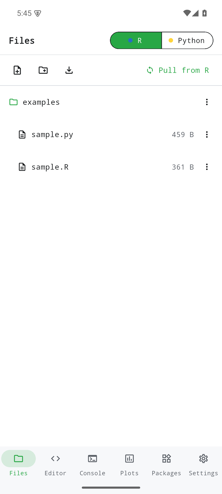

# Atelier — Vignette & Tutorial (v0.1.0)

> **Établi Atelier** is an offline polyglot IDE that runs **R** (via WebR) and
> **Python** (via Pyodide) as switchable kernels inside an embedded WebAssembly
> runtime, sharing a single virtual filesystem. `numpy`, `pandas`, `scipy`,
> `matplotlib` and `scikit-learn` come pre-bundled; plots export to PNG. No
> network, no account, no telemetry — the runtimes live on the device.
>
> **Stack:** Flutter (Dart), `flutter_inappwebview` hosting WebR + Pyodide WASM.
> Part of the **établi** suite (Coder design system). Figures are real screenshots
> of the v0.1.0 build on an Android emulator, regenerated by `scripts/capture.sh`.

## Table of contents
1. [Quick start](#quick-start)
2. [Editor & the R / Python kernel toggle](#feature-editor)
3. [Console](#feature-console)
4. [Plots](#feature-plots)
5. [Packages](#feature-packages)
6. [Files](#feature-files)
7. [Settings](#feature-settings)
8. [In-app examples](#in-app-examples)
9. [Reproducing these figures](#reproducing-these-figures)
10. [Known gaps](#known-gaps)
11. [Version](#version)

## Quick start
Install `atelier-0.1.0.apk` and open it. On first launch the embedded WebR and
Pyodide runtimes unpack (a few seconds). You land on the **Editor** with an empty
scratch buffer and the kernel set to **R**.


## Feature: Editor
The Editor is a code editor over a scratch buffer with a **Run** action and a
**R / Python** kernel toggle in the top bar — flip it to switch which interpreter
executes your code. Both kernels share one virtual filesystem, so a file written
from R is readable from Python.


## Feature: Console
The **Console** hosts the live kernel session — start it, then run code from the
Editor and see text output here. The output panel header tracks the active kernel
(`Output · R` / `Output · Python`).


## Feature: Plots
Plots produced by base R, ggplot2 or matplotlib render in the **Plots** tab and
can be exported to PNG.


## Feature: Packages
**Packages** installs additional R packages from `repo.r-wasm.org` (WebR WASM
binaries) or Python packages via Pyodide. Bundled packages already work offline;
installing more needs a network connection and a running kernel.


## Feature: Files
**Files** browses the shared virtual filesystem — create, open and manage the
files both kernels see.


## Feature: Settings
**Settings** covers theme (light / dark / system) and editor/runtime preferences.


## In-app examples
On first launch the app seeds an `examples/` folder into the workspace with two
runnable scripts — `sample.R` (R) and `sample.py` (Python, using `numpy` and
`matplotlib`). Both plot a histogram, so each exercises a console output and a
generated plot, running on the bundled WebR / Pyodide runtimes offline. Open
either from **Files** and press **Run** (`sample.py` selects the Python kernel).




Live execution requires the WebR / Pyodide kernel to finish booting (a few
seconds on a real device); the figures show the bundled samples available in the
workspace and open in the editor.

## Reproducing these figures
```bash
flutter pub get
flutter build apk --debug
adb install -r build/app/outputs/flutter-apk/app-debug.apk
bash scripts/capture.sh
```
Device: 1080×2400 @ 420dpi, animations disabled. Slugs in `scripts/capture.sh`
map 1:1 to the filenames above. The harness allows extra settle time for the WASM
runtimes to unpack on first launch.

## Known gaps
- **Bundled samples (capstone §2.5):** *Closed.* Atelier now ships
  `examples/sample.R` + `examples/sample.py`, seeded into the workspace on first
  launch (see [In-app examples](#in-app-examples)). Both are runnable on the
  bundled WebR / Pyodide runtimes offline. The walkthrough figures still show the
  real UI states rather than a single fully-rendered sample-run, since live
  execution depends on the kernel finishing its boot (a few seconds on device).

## Version
Documents établi **Atelier v0.1.0** (applicationId `com.raban.etabli.atelier`).
Part of the établi (workbench) suite.
